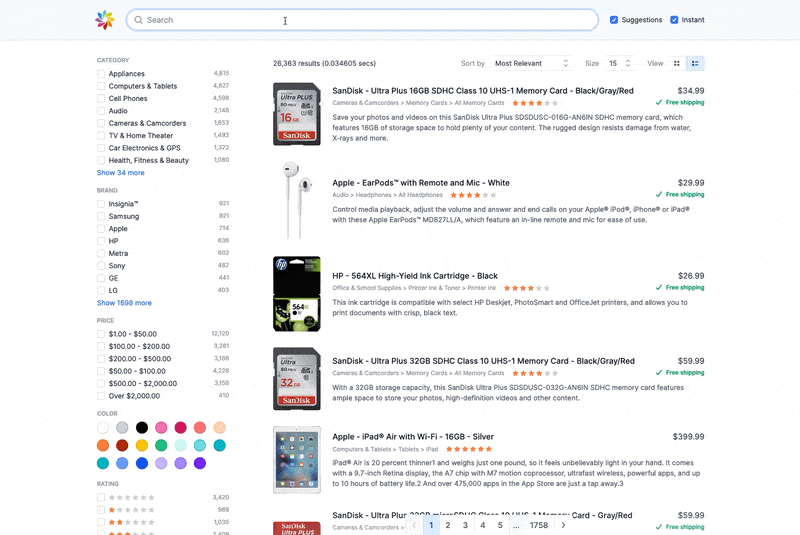

# Ecommerce Example

A lightweight and fast example user interface using the Sajari JavaScript SDK in an ecommerce project.

The demo uses:

- [Preact](https://preactjs.com/)
- [Preact CLI](https://preactjs.com/cli/)
- [Tailwind](https://tailwindcss.com/)
- [PurgeCSS](https://purgecss.com/)

## Getting started

- Clone the [`sajari-sdk-js`](https://github.com/sajari/sajari-sdk-js) repo.
- `cd` to `examples/ecommerce`.
- Edit `sajari.config.js` with the correct project, collection, pipeline, etc.
- Run `yarn && yarn start`.
- Open a browser and head to [http://localhost:8080](http://localhost:8080).

# TODO

- [] Convert to TypeScript
- [] Use hooks/context more
- [] Use `@sajari-ui`
